# C4 Container Diagram - Smart University Platform

## Overview
This diagram shows the container-level architecture - all services, databases, and their interactions.

## Mermaid Diagram

```mermaid
graph TB
    subgraph Users["👥 Users"]
        U1["👤 Student"]
        U2["👨‍🏫 Professor"]
        U3["🏪 Vendor"]
    end

    subgraph Frontend["📱 Frontend Layer"]
        SPA["React SPA<br/>───────────<br/>Vite + TypeScript<br/>TailwindCSS<br/>───────────<br/>:5173 dev / :3200 docker"]
    end

    subgraph Gateway["🚪 API Gateway Layer"]
        GW["API Gateway<br/>───────────<br/>Spring Cloud Gateway<br/>JWT Validation<br/>Rate Limiting<br/>───────────<br/>:8080"]
    end

    subgraph Services["⚙️ Microservices Layer"]
        AUTH["Auth Service<br/>───────────<br/>JWT Issuance<br/>User Management<br/>───────────<br/>:8081"]
        
        BOOK["Booking Service<br/>───────────<br/>Resource Management<br/>Reservation System<br/>───────────<br/>:8082"]
        
        EXAM["Exam Service<br/>───────────<br/>State Pattern<br/>Circuit Breaker<br/>───────────<br/>:8083"]
        
        MARKET["Marketplace<br/>───────────<br/>Saga Orchestrator<br/>Product Catalog<br/>───────────<br/>:8084"]
        
        PAY["Payment Service<br/>───────────<br/>Strategy Pattern<br/>Mock Payments<br/>───────────<br/>:8085"]
        
        NOTIF["Notification<br/>───────────<br/>Event Listener<br/>Observer Pattern<br/>───────────<br/>:8086"]
        
        DASH["Dashboard<br/>───────────<br/>IoT Sensors<br/>Shuttle Tracking<br/>───────────<br/>:8087"]
    end

    subgraph Data["💾 Data Layer"]
        subgraph Databases["PostgreSQL Instances"]
            DB1[("Auth DB")]
            DB2[("Booking DB")]
            DB3[("Exam DB")]
            DB4[("Market DB")]
            DB5[("Payment DB")]
            DB6[("Notif DB")]
            DB7[("Dashboard DB")]
        end
        
        REDIS[("Redis<br/>Cache")]
        
        MQ["RabbitMQ<br/>───────────<br/>Event Bus<br/>───────────<br/>:5800 / :15800"]
    end

    %% User connections
    U1 & U2 & U3 --> SPA

    %% Frontend to Gateway
    SPA -->|"HTTP/JWT"| GW

    %% Gateway to Services
    GW -->|"/auth/**"| AUTH
    GW -->|"/booking/**"| BOOK
    GW -->|"/exam/**"| EXAM
    GW -->|"/market/**"| MARKET
    GW -->|"/payment/**"| PAY
    GW -->|"/notification/**"| NOTIF
    GW -->|"/dashboard/**"| DASH

    %% Service to Database
    AUTH --> DB1
    BOOK --> DB2
    EXAM --> DB3
    MARKET --> DB4
    PAY --> DB5
    NOTIF --> DB6
    DASH --> DB7

    %% Special connections
    MARKET --> REDIS
    MARKET -->|"Saga"| PAY
    EXAM -->|"Circuit Breaker"| NOTIF

    %% Event publishing
    MARKET -.->|"order.confirmed"| MQ
    EXAM -.->|"exam.started"| MQ
    MQ -.->|"subscribe"| NOTIF

    %% Styling
    style Frontend fill:#e3f2fd,stroke:#1565c0
    style Gateway fill:#fff3e0,stroke:#ef6c00
    style Services fill:#e8f5e9,stroke:#2e7d32
    style Data fill:#fce4ec,stroke:#c2185b
```

## Service Details

| Service | Port | Database | Key Patterns | Responsibilities |
|---------|------|----------|--------------|------------------|
| **API Gateway** | 8080 | - | Gateway, Filter | Routing, JWT validation, RBAC |
| **Auth Service** | 8081 | PostgreSQL | Repository | User registration, JWT issuance |
| **Booking Service** | 8082 | PostgreSQL | Repository | Resource management, reservations |
| **Exam Service** | 8083 | PostgreSQL | State, Circuit Breaker | Exam lifecycle, submissions |
| **Marketplace** | 8084 | PostgreSQL + Redis | Saga | Products, orders, checkout |
| **Payment Service** | 8085 | PostgreSQL | Strategy | Payment authorization |
| **Notification** | 8086 | PostgreSQL | Observer | Event logging, notifications |
| **Dashboard** | 8087 | PostgreSQL | Repository | Sensors, shuttle tracking |

## Communication Patterns

### Synchronous (HTTP/REST)
- **SPA → Gateway**: All client requests
- **Gateway → Services**: Routed API calls
- **Marketplace → Payment**: Saga orchestration
- **Exam → Notification**: Circuit breaker protected

### Asynchronous (RabbitMQ)
- **Marketplace → RabbitMQ**: `order.confirmed` events
- **Exam → RabbitMQ**: `exam.started` events
- **RabbitMQ → Notification**: Event consumption

## Data Isolation

Each service owns its database (Database-per-Service pattern):
- No direct database access between services
- Data shared only via APIs or events
- Enables independent scaling and deployment
