# C4 Context Diagram - Smart University Platform

## Overview
This diagram shows the highest level of abstraction - the system context. It identifies the users (actors) and external systems that interact with the Smart University Platform.

## Mermaid Diagram

```mermaid
graph TB
    subgraph Actors["👥 System Actors"]
        Student["👤 Student<br/><small>Takes exams, books resources,<br/>purchases from marketplace</small>"]
        Professor["👨‍🏫 Professor<br/><small>Creates exams, manages<br/>course content</small>"]
        Vendor["🏪 Vendor<br/><small>Manages products,<br/>tracks orders</small>"]
        Admin["👨‍💼 Administrator<br/><small>System configuration,<br/>user management</small>"]
    end

    subgraph Platform["🏛️ Smart University Platform"]
        SPA["📱 Web Application<br/><small>React + TypeScript SPA</small>"]
        Backend["⚙️ Backend Services<br/><small>8 Microservices<br/>Spring Boot</small>"]
        Data["💾 Data Layer<br/><small>PostgreSQL + Redis<br/>RabbitMQ</small>"]
    end

    subgraph External["🌐 External Systems"]
        Email["📧 Email Provider<br/><small>Future: SendGrid/SES</small>"]
        Payment["💳 Payment Gateway<br/><small>Mock Implementation</small>"]
        IoT["📡 IoT Sensors<br/><small>Temperature, Humidity<br/>Shuttle GPS</small>"]
    end

    Student --> SPA
    Professor --> SPA
    Vendor --> SPA
    Admin --> SPA

    SPA --> Backend
    Backend --> Data
    Backend -.-> Email
    Backend -.-> Payment
    Backend -.-> IoT

    style Platform fill:#e1f5fe,stroke:#01579b
    style Actors fill:#f3e5f5,stroke:#4a148c
    style External fill:#fff3e0,stroke:#e65100
```

## Actor Descriptions

| Actor | Role | Key Actions |
|-------|------|-------------|
| **Student** | Primary user | Book resources, take exams, purchase items |
| **Professor** | Content creator | Create/manage exams, view bookings |
| **Vendor** | Marketplace seller | Add products, manage inventory |
| **Administrator** | System manager | User management, system config |

## System Boundaries

### Internal (Smart University Platform)
- **Web Application**: Single-page React application
- **Backend Services**: 8 loosely-coupled microservices
- **Data Layer**: Per-service databases + shared message broker

### External Systems
- **Email Provider**: Notification delivery (future)
- **Payment Gateway**: Transaction processing (mocked)
- **IoT Sensors**: Campus environmental data

## Key Interactions

1. **User → SPA**: Browser-based access via HTTPS
2. **SPA → Backend**: REST API calls through API Gateway
3. **Backend → External**: Async communication for notifications and payments
