# Circuit Breaker Pattern - Exam → Notification

## Overview
The Circuit Breaker pattern prevents cascading failures when the Notification Service is unavailable. Implemented using Resilience4j in the Exam Service.

## State Machine Diagram


## Sequence Diagram - Circuit Breaker in Action

```mermaid
sequenceDiagram
    autonumber
    participant ES as 📝 Exam Service
    participant CB as 🔌 Circuit Breaker
    participant NS as 🔔 Notification Service

    rect rgb(230, 255, 230)
        Note over ES,NS: 🟢 CLOSED State - Normal Operation
        ES->>CB: notifyExamStarted(examId)
        CB->>NS: POST /notification/notify/exam/{id}
        NS-->>CB: 202 Accepted
        CB-->>ES: Success
        Note over CB: Failure count: 0
    end

    rect rgb(255, 235, 235)
        Note over ES,NS: 🔴 Failures Accumulate → OPEN
        loop 5 consecutive failures
            ES->>CB: notifyExamStarted(examId)
            CB->>NS: POST /notification/notify/exam/{id}
            NS--xCB: 500 Error / Timeout
            CB-->>ES: Fallback (logged, continue)
            Note over CB: Failure count++
        end
        Note over CB: Threshold reached!<br/>State → OPEN
    end

    rect rgb(255, 245, 230)
        Note over ES,NS: 🟠 OPEN State - Fast Fail
        ES->>CB: notifyExamStarted(examId)
        Note over CB: Circuit OPEN<br/>Skip call to NS
        CB-->>ES: Fallback immediately
        Note over ES: Exam starts anyway!<br/>Notification skipped
    end

    rect rgb(230, 245, 255)
        Note over ES,NS: 🔵 HALF_OPEN - Recovery Test
        Note over CB: 30s timeout elapsed<br/>State → HALF_OPEN
        ES->>CB: notifyExamStarted(examId)
        CB->>NS: POST /notification/notify/exam/{id}
        alt NS recovered
            NS-->>CB: 202 Accepted
            CB-->>ES: Success
            Note over CB: State → CLOSED
        else NS still failing
            NS--xCB: 500 Error
            CB-->>ES: Fallback
            Note over CB: State → OPEN
        end
    end
```



## Configuration

```yaml
# application.yml (exam-service)
resilience4j:
  circuitbreaker:
    instances:
      notificationCb:
        registerHealthIndicator: true
        slidingWindowSize: 10
        minimumNumberOfCalls: 5
        failureRateThreshold: 50
        waitDurationInOpenState: 30s
        permittedNumberOfCallsInHalfOpenState: 3
        automaticTransitionFromOpenToHalfOpenEnabled: true
```

## Configuration Explained

| Parameter | Value | Meaning |
|-----------|-------|---------|
| `slidingWindowSize` | 10 | Evaluate last 10 calls |
| `minimumNumberOfCalls` | 5 | Need 5 calls before evaluating |
| `failureRateThreshold` | 50% | Open if 50%+ fail |
| `waitDurationInOpenState` | 30s | Wait before testing recovery |
| `permittedNumberOfCallsInHalfOpenState` | 3 | Allow 3 test calls |

## Code Implementation

```java
// NotificationClient.java
@Service
public class NotificationClient {
    
    private final RestClient restClient;
    
    @CircuitBreaker(name = "notificationCb", fallbackMethod = "notifyFallback")
    public void notifyExamStarted(Long examId, Long tenantId) {
        restClient.post()
            .uri("/notification/notify/exam/{id}", examId)
            .header("X-Tenant-Id", tenantId.toString())
            .retrieve()
            .toBodilessEntity();
    }
    
    // Fallback when circuit is OPEN or call fails
    private void notifyFallback(Long examId, Long tenantId, Throwable t) {
        log.warn("Circuit breaker fallback for exam {}: {}", examId, t.getMessage());
        // Exam continues without notification
        // Event still published to RabbitMQ as backup
    }
}
```

## Why Circuit Breaker Here?

### Problem Without Circuit Breaker
```
Exam Start Request
    ↓
Call Notification Service (down)
    ↓
Wait for timeout (30s)
    ↓
Retry (fails again)
    ↓
User waits 60+ seconds
    ↓
Exam start fails completely ❌
```

### Solution With Circuit Breaker
```
Exam Start Request
    ↓
Circuit Breaker checks state
    ↓
If OPEN: Skip call, use fallback (instant)
    ↓
Exam starts successfully ✅
    ↓
Notification logged for retry later
```

## Benefits

1. **Fault Isolation**: Notification failure doesn't block exam start
2. **Fast Failure**: No waiting for timeouts when service is known to be down
3. **Self-Healing**: Automatically tests recovery after timeout
4. **Graceful Degradation**: Core functionality preserved, non-critical features skipped
