# Event-Driven Architecture - RabbitMQ Flow

## Overview
This diagram shows the event-driven communication pattern using RabbitMQ as the message broker. Services publish domain events that are consumed by the Notification Service.

## Event Flow Diagram

```mermaid
flowchart TB
    subgraph Publishers["📤 Event Publishers"]
        MS["🛒 Marketplace Service"]
        ES["📝 Exam Service"]
    end
    
    subgraph RabbitMQ["📨 RabbitMQ Message Broker"]
        direction TB
        
        subgraph Exchanges["Exchanges"]
            ME["market.exchange<br/><small>topic</small>"]
            EE["exam.exchange<br/><small>topic</small>"]
        end
        
        subgraph Queues["Queues"]
            MQ["market.order.confirmed.queue"]
            EQ["exam.exam.started.queue"]
        end
        
        ME -->|"routing: order.confirmed"| MQ
        EE -->|"routing: exam.started"| EQ
    end
    
    subgraph Consumers["📥 Event Consumers"]
        NS["🔔 Notification Service"]
    end
    
    MS -->|"OrderConfirmedEvent"| ME
    ES -->|"ExamStartedEvent"| EE
    
    MQ --> NS
    EQ --> NS
    
    subgraph Actions["📋 Notification Actions"]
        NL["📝 Log to Database"]
        EM["📧 Send Email (Future)"]
        WS["🔌 WebSocket Push (Future)"]
    end
    
    NS --> NL
    NS -.-> EM
    NS -.-> WS
    
    style Publishers fill:#E8F5E9,stroke:#2E7D32
    style RabbitMQ fill:#FFF3E0,stroke:#EF6C00
    style Consumers fill:#E3F2FD,stroke:#1565C0
    style Actions fill:#FCE4EC,stroke:#C2185B
```



## Detailed Event Sequence

```mermaid
sequenceDiagram
    autonumber
    participant MS as 🛒 Marketplace
    participant MDB as 💾 Market DB
    participant MQ as 📨 RabbitMQ
    participant NS as 🔔 Notification
    participant NDB as 💾 Notif DB

    rect rgb(230, 255, 230)
        Note over MS,NDB: Order Confirmed Event Flow
        
        MS->>MDB: COMMIT order (CONFIRMED)
        MS->>MQ: publish(OrderConfirmedEvent)
        Note over MQ: Exchange: market.exchange<br/>Routing: order.confirmed
        
        MQ-->>NS: deliver message
        NS->>NS: Deserialize event
        NS->>NDB: INSERT notification_log
        Note over NDB: type: ORDER_CONFIRMED<br/>payload: {orderId, userId, items}
    end

    rect rgb(230, 245, 255)
        Note over MS,NDB: Exam Started Event Flow
        
        Note over MS: (Exam Service)
        MS->>MDB: UPDATE exam.state = LIVE
        MS->>MQ: publish(ExamStartedEvent)
        Note over MQ: Exchange: exam.exchange<br/>Routing: exam.started
        
        MQ-->>NS: deliver message
        NS->>NS: Deserialize event
        NS->>NDB: INSERT notification_log
        Note over NDB: type: EXAM_STARTED<br/>payload: {examId, title, startTime}
    end
```



## Event Definitions

### OrderConfirmedEvent

```java
public record OrderConfirmedEvent(
    Long orderId,
    Long userId,
    Long tenantId,
    BigDecimal totalAmount,
    List<OrderItemDto> items,
    Instant confirmedAt
) {}
```

**Published when:** Order successfully confirmed after payment and stock deduction
**Exchange:** `market.exchange`
**Routing Key:** `order.confirmed`

### ExamStartedEvent

```java
public record ExamStartedEvent(
    Long examId,
    String title,
    Long creatorId,
    Long tenantId,
    Instant startedAt
) {}
```

**Published when:** Professor starts an exam (state: SCHEDULED → LIVE)
**Exchange:** `exam.exchange`
**Routing Key:** `exam.started`

## RabbitMQ Configuration

### Marketplace Service

```java
@Configuration
public class MessagingConfig {
    
    @Bean
    public TopicExchange marketExchange() {
        return new TopicExchange("market.exchange");
    }
    
    @Bean
    public Queue orderConfirmedQueue() {
        return new Queue("market.order.confirmed.queue", true);
    }
    
    @Bean
    public Binding orderConfirmedBinding() {
        return BindingBuilder
            .bind(orderConfirmedQueue())
            .to(marketExchange())
            .with("order.confirmed");
    }
}
```

### Notification Service (Consumer)

```java
@Component
public class NotificationListeners {
    
    @RabbitListener(queues = "market.order.confirmed.queue")
    public void handleOrderConfirmed(OrderConfirmedEvent event) {
        notificationService.logNotification(
            "ORDER_CONFIRMED",
            event.userId(),
            event.tenantId(),
            toJson(event)
        );
    }
    
    @RabbitListener(queues = "exam.exam.started.queue")
    public void handleExamStarted(ExamStartedEvent event) {
        notificationService.logNotification(
            "EXAM_STARTED",
            event.creatorId(),
            event.tenantId(),
            toJson(event)
        );
    }
}
```

## Event Flow Matrix

| Event | Publisher | Exchange | Routing Key | Consumer | Action |
|-------|-----------|----------|-------------|----------|--------|
| OrderConfirmed | Marketplace | market.exchange | order.confirmed | Notification | Log + (Email) |
| ExamStarted | Exam | exam.exchange | exam.started | Notification | Log + (Push) |

## Benefits of Event-Driven Architecture

### 1. Loose Coupling
```
Before (Synchronous):
Marketplace → HTTP → Notification (blocking)

After (Event-Driven):
Marketplace → RabbitMQ → Notification (async)
```

### 2. Resilience
- If Notification Service is down, messages queue up
- No data loss - RabbitMQ persists messages
- Services can be restarted independently

### 3. Scalability
- Multiple Notification instances can consume from same queue
- Load balancing built into RabbitMQ
- Publishers don't need to know about consumers

### 4. Extensibility
```
Future: Add more consumers without changing publishers

market.exchange
    ├── order.confirmed → Notification Service
    ├── order.confirmed → Analytics Service (new)
    └── order.confirmed → Inventory Service (new)
```

## Monitoring

### RabbitMQ Management UI
- URL: `http://localhost:15672`
- Default credentials: `guest/guest`

### Key Metrics to Watch
| Metric | Healthy Value | Alert Threshold |
|--------|---------------|-----------------|
| Queue depth | < 100 | > 1000 |
| Consumer count | ≥ 1 | 0 |
| Message rate | Stable | Sudden spike |
| Unacked messages | < 10 | > 100 |
