# Saga Pattern - Marketplace Checkout Flow

## Overview
The Saga pattern manages distributed transactions across Marketplace and Payment services. This orchestration-based saga ensures data consistency without distributed locks.

## Sequence Diagram

```mermaid
sequenceDiagram
    autonumber
    participant User as 👤 User (SPA)
    participant GW as 🚪 API Gateway
    participant MS as 🛒 Marketplace Service
    participant MDB as 💾 Market DB
    participant PS as 💳 Payment Service
    participant PDB as 💾 Payment DB
    participant MQ as 📨 RabbitMQ
    participant NS as 🔔 Notification

    rect rgb(230, 245, 255)
        Note over User,NS: 🟢 HAPPY PATH - Successful Order
        
        User->>+GW: POST /market/orders/checkout<br/>{items: [{productId, qty}]}
        GW->>+MS: Forward + JWT Headers
        
        Note over MS,MDB: Step 1: Create Order
        MS->>MDB: BEGIN TRANSACTION
        MS->>MDB: INSERT order (status=PENDING)
        MS->>MDB: INSERT order_items
        MS->>MDB: COMMIT
        
        Note over MS,PS: Step 2: Authorize Payment
        MS->>+PS: POST /payment/authorize<br/>{orderId, amount}
        PS->>PDB: INSERT payment (AUTHORIZED)
        PS-->>-MS: 200 OK {paymentId, status: AUTHORIZED}
        
        Note over MS,MDB: Step 3: Deduct Stock
        MS->>MDB: BEGIN TRANSACTION
        MS->>MDB: SELECT products FOR UPDATE
        MS->>MDB: UPDATE stock = stock - qty
        MS->>MDB: UPDATE order status = CONFIRMED
        MS->>MDB: COMMIT
        
        Note over MS,MQ: Step 4: Publish Event
        MS->>MQ: publish(OrderConfirmedEvent)
        MQ-->>NS: deliver event
        NS->>NS: Log notification
        
        MS-->>-GW: 201 Created {order}
        GW-->>-User: 201 Created
    end

    rect rgb(255, 235, 235)
        Note over User,NS: 🔴 COMPENSATION PATH - Payment Failed
        
        User->>+GW: POST /market/orders/checkout
        GW->>+MS: Forward request
        
        MS->>MDB: INSERT order (PENDING)
        MS->>+PS: POST /payment/authorize
        PS-->>-MS: 402 Payment Failed
        
        Note over MS,MDB: Compensation: Cancel Order
        MS->>MDB: UPDATE order status = CANCELED
        
        MS-->>-GW: 402 Payment Failed
        GW-->>-User: 402 Payment Failed
    end

    rect rgb(255, 245, 230)
        Note over User,NS: 🟠 COMPENSATION PATH - Stock Insufficient
        
        User->>+GW: POST /market/orders/checkout
        GW->>+MS: Forward request
        
        MS->>MDB: INSERT order (PENDING)
        MS->>+PS: POST /payment/authorize
        PS->>PDB: INSERT payment (AUTHORIZED)
        PS-->>-MS: 200 OK (AUTHORIZED)
        
        MS->>MDB: SELECT products FOR UPDATE
        Note over MS: Stock check fails!
        
        Note over MS,PS: Compensation: Cancel Payment
        MS->>+PS: POST /payment/cancel/{orderId}
        PS->>PDB: UPDATE payment = CANCELED
        PS-->>-MS: 200 OK
        
        MS->>MDB: UPDATE order status = CANCELED
        
        MS-->>-GW: 409 Conflict (Insufficient Stock)
        GW-->>-User: 409 Conflict
    end
```



## Saga Steps Breakdown

### Forward Flow (Happy Path)

| Step | Service | Action | Database Change |
|------|---------|--------|-----------------|
| 1 | Marketplace | Create Order | `orders.status = PENDING` |
| 2 | Payment | Authorize | `payments.status = AUTHORIZED` |
| 3 | Marketplace | Deduct Stock | `products.stock -= qty` |
| 4 | Marketplace | Confirm Order | `orders.status = CONFIRMED` |
| 5 | Marketplace | Publish Event | RabbitMQ message |

### Compensation Flow

| Failure Point | Compensation Actions |
|---------------|---------------------|
| Payment fails | Cancel order (status = CANCELED) |
| Stock insufficient | Cancel payment + Cancel order |
| Any step fails | Rollback all previous steps |

## Code Reference

```java
// OrderSagaService.java (Simplified)
@Transactional
public Order checkout(List<OrderItemRequest> items, Long userId, Long tenantId) {
    // Step 1: Create pending order
    Order order = createPendingOrder(items, userId, tenantId);
    
    try {
        // Step 2: Authorize payment
        PaymentResponse payment = paymentClient.authorize(order);
        
        // Step 3: Deduct stock (with pessimistic lock)
        deductStock(order.getItems());
        
        // Step 4: Confirm order
        order.setStatus(OrderStatus.CONFIRMED);
        orderRepository.save(order);
        
        // Step 5: Publish event
        rabbitTemplate.convertAndSend("order.confirmed", new OrderConfirmedEvent(order));
        
        return order;
    } catch (PaymentException e) {
        // Compensation: Cancel order
        order.setStatus(OrderStatus.CANCELED);
        throw new CheckoutException("Payment failed");
    } catch (InsufficientStockException e) {
        // Compensation: Cancel payment + order
        paymentClient.cancel(order.getId());
        order.setStatus(OrderStatus.CANCELED);
        throw new CheckoutException("Insufficient stock");
    }
}
```

## Key Design Decisions

1. **Orchestration vs Choreography**: Chose orchestration (Marketplace as coordinator) for simpler debugging
2. **Pessimistic Locking**: `SELECT FOR UPDATE` prevents race conditions on stock
3. **Idempotency**: Payment authorization is idempotent via orderId
4. **Event Publishing**: Only after successful commit to ensure consistency
