# User Journey Flowchart - Role-Based Flows

## Overview
Simplified user journey diagram showing the main flows for each user role without technical implementation details.

## Complete User Journey

```mermaid
flowchart TB
    Start([🚀 Enter Platform]) --> Auth{Authenticated?}
    
    Auth -->|No| Login[📝 Login / Register]
    Login --> AuthService[🔐 Auth Service]
    AuthService --> JWT[🎫 Receive JWT Token]
    JWT --> Auth
    
    Auth -->|Yes| Role{👤 User Role?}
    
    %% ═══════════════════════════════════════════
    %% STUDENT FLOW
    %% ═══════════════════════════════════════════
    Role -->|Student| StudentDash[📊 Student Dashboard]
    
    subgraph StudentFlows["👤 Student Actions"]
        StudentDash --> S1{Choose Action}
        
        S1 -->|📅 Book Resource| BookFlow
        S1 -->|🛒 Marketplace| ShopFlow
        S1 -->|📝 Take Exam| ExamFlow
        S1 -->|📈 View Dashboard| DashFlow
        
        subgraph BookFlow["Resource Booking"]
            B1[View Resources] --> B2[Select Time Slot]
            B2 --> B3{Available?}
            B3 -->|Yes| B4[✅ Booking Confirmed]
            B3 -->|No| B5[❌ Conflict - Choose Another]
            B5 --> B2
        end
        
        subgraph ShopFlow["Marketplace Shopping"]
            M1[Browse Products] --> M2[Add to Cart]
            M2 --> M3[Checkout]
            M3 --> M4{Payment OK?}
            M4 -->|Yes| M5{Stock OK?}
            M5 -->|Yes| M6[✅ Order Confirmed]
            M4 -->|No| M7[❌ Payment Failed]
            M5 -->|No| M8[❌ Out of Stock]
        end
        
        subgraph ExamFlow["Online Exam"]
            E1[View Available Exams] --> E2[Select Exam]
            E2 --> E3{Exam Status?}
            E3 -->|Live| E4[📝 Answer Questions]
            E3 -->|Scheduled| E5[⏰ Wait for Start]
            E3 -->|Closed| E6[🔒 Exam Ended]
            E4 --> E7[Submit Answers]
            E7 --> E8[✅ Submission Recorded]
        end
        
        subgraph DashFlow["IoT Dashboard"]
            D1[View Sensors] --> D2[🌡️ Temperature]
            D1 --> D3[💧 Humidity]
            D1 --> D4[🚌 Shuttle Location]
        end
    end
    
    %% ═══════════════════════════════════════════
    %% PROFESSOR FLOW
    %% ═══════════════════════════════════════════
    Role -->|Professor| ProfDash[📊 Professor Dashboard]
    
    subgraph ProfFlows["👨‍🏫 Professor Actions"]
        ProfDash --> P1{Choose Action}
        
        P1 -->|📝 Manage Exams| ExamMgmt
        P1 -->|📅 View Bookings| ViewBook
        
        subgraph ExamMgmt["Exam Management"]
            PM1[Create Exam] --> PM2[📋 Add Questions]
            PM2 --> PM3[📅 Schedule Exam]
            PM3 --> PM4[▶️ Start Exam]
            PM4 --> PM5[👁️ Monitor Students]
            PM5 --> PM6[⏹️ End Exam]
            PM6 --> PM7[📊 View Results]
        end
        
        subgraph ViewBook["Booking Overview"]
            PB1[View All Reservations]
            PB1 --> PB2[Filter by Resource]
            PB1 --> PB3[Filter by Date]
        end
    end
    
    %% ═══════════════════════════════════════════
    %% VENDOR FLOW
    %% ═══════════════════════════════════════════
    Role -->|Vendor| VendorDash[📊 Vendor Dashboard]
    
    subgraph VendorFlows["🏪 Vendor Actions"]
        VendorDash --> V1{Choose Action}
        
        V1 -->|📦 Manage Products| ProdMgmt
        V1 -->|📋 View Orders| OrderMgmt
        
        subgraph ProdMgmt["Product Management"]
            VP1[Add New Product] --> VP2[Set Price & Stock]
            VP2 --> VP3[✅ Product Published]
            VP4[Update Inventory] --> VP5[Adjust Stock Levels]
        end
        
        subgraph OrderMgmt["Order Tracking"]
            VO1[View All Orders]
            VO1 --> VO2[Pending Orders]
            VO1 --> VO3[Confirmed Orders]
            VO1 --> VO4[Canceled Orders]
        end
    end
    
    %% End states
    B4 & M6 & E8 & D4 & PM7 & VP3 & VO4 --> End([🏁 Session Complete])
    
    %% Styling
    style Start fill:#90EE90,stroke:#228B22
    style End fill:#FFB6C1,stroke:#DC143C
    style StudentFlows fill:#E3F2FD,stroke:#1565C0
    style ProfFlows fill:#F3E5F5,stroke:#7B1FA2
    style VendorFlows fill:#FFF3E0,stroke:#EF6C00
```



## Simplified Role Swimlanes

```mermaid
flowchart LR
    subgraph Student["👤 Student"]
        direction TB
        S1[Login] --> S2[Book Resources]
        S2 --> S3[Shop Marketplace]
        S3 --> S4[Take Exams]
        S4 --> S5[View Dashboard]
    end
    
    subgraph Professor["👨‍🏫 Professor"]
        direction TB
        P1[Login] --> P2[Create Exam]
        P2 --> P3[Add Questions]
        P3 --> P4[Start Exam]
        P4 --> P5[View Results]
    end
    
    subgraph Vendor["🏪 Vendor"]
        direction TB
        V1[Login] --> V2[Add Products]
        V2 --> V3[Set Pricing]
        V3 --> V4[Track Orders]
    end
    
    Student ~~~ Professor ~~~ Vendor
```



## Key User Stories

### Student Stories
| ID | Story | Acceptance Criteria |
|----|-------|---------------------|
| US-01 | Book a study room | Can see availability, no double-booking |
| US-02 | Purchase workshop ticket | Payment processed, stock updated |
| US-03 | Take online exam | Can only submit during LIVE state |
| US-04 | View campus sensors | Real-time temperature/humidity |

### Professor Stories
| ID | Story | Acceptance Criteria |
|----|-------|---------------------|
| UP-01 | Create exam with questions | Exam saved in DRAFT state |
| UP-02 | Start scheduled exam | State changes to LIVE, students notified |
| UP-03 | End exam | State changes to CLOSED, no more submissions |

### Vendor Stories
| ID | Story | Acceptance Criteria |
|----|-------|---------------------|
| UV-01 | Add product to marketplace | Product visible to students |
| UV-02 | Update stock levels | Prevents overselling |
| UV-03 | View order history | Filter by status |

## Navigation Map

```
┌─────────────────────────────────────────────────────────────┐
│                    🏠 Home / Login                          │
└─────────────────────────┬───────────────────────────────────┘
                          │
        ┌─────────────────┼─────────────────┐
        │                 │                 │
        ▼                 ▼                 ▼
┌───────────────┐ ┌───────────────┐ ┌───────────────┐
│   📊 Student  │ │  📊 Professor │ │   📊 Vendor   │
│   Dashboard   │ │   Dashboard   │ │   Dashboard   │
├───────────────┤ ├───────────────┤ ├───────────────┤
│ • Booking     │ │ • Exams       │ │ • Products    │
│ • Marketplace │ │ • Bookings    │ │ • Orders      │
│ • Exams       │ │               │ │ • Inventory   │
│ • Dashboard   │ │               │ │               │
└───────────────┘ └───────────────┘ └───────────────┘
```
